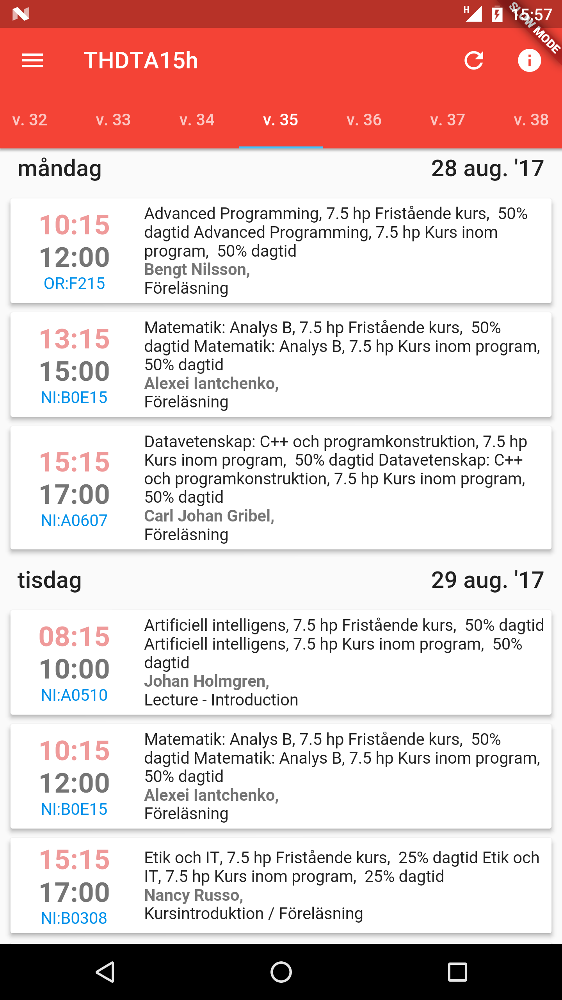
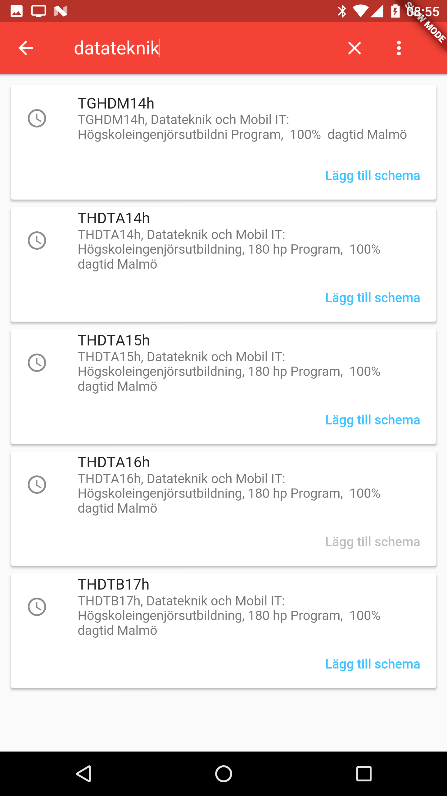
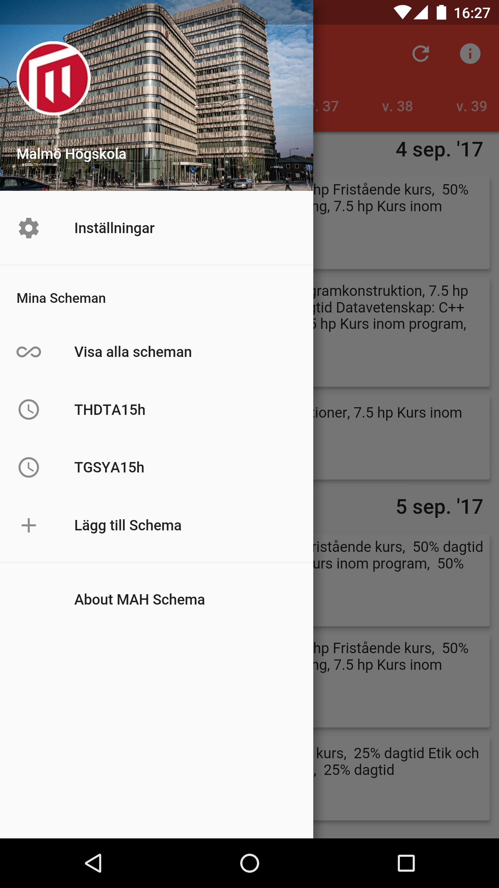
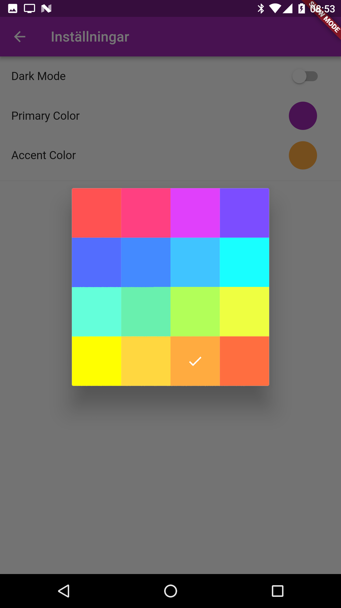
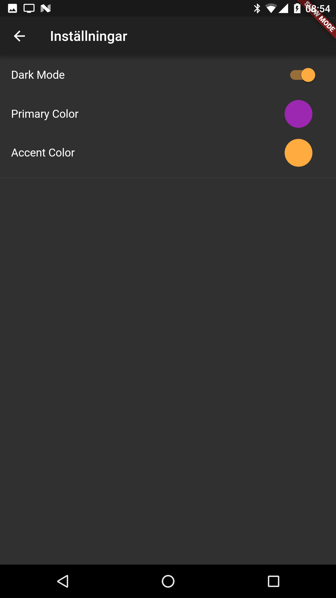
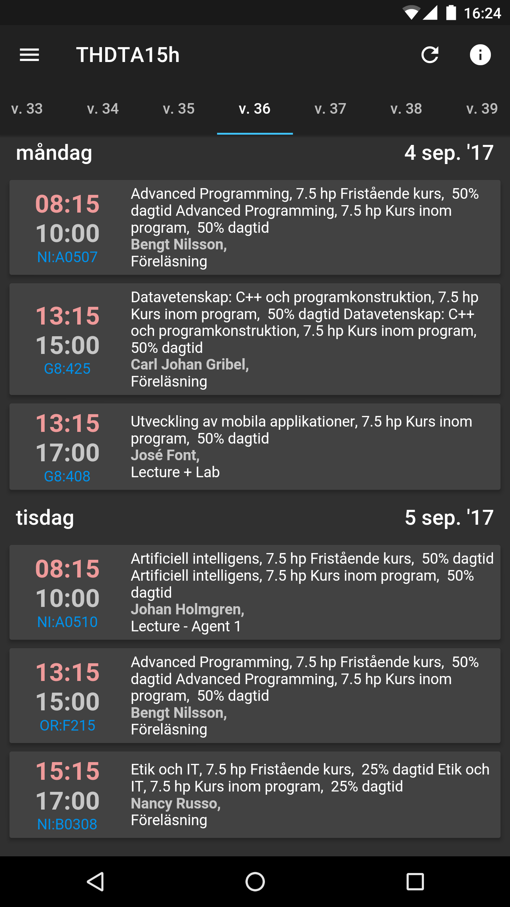

# MAH Schema

This is the [Dart/Flutter](http://flutter.io/) version of [MAH Schema](https://play.google.com/store/apps/details?id=com.mahschema), an app for students to see their schedules at Malmoe University.

  |   | 
| ------------------------- | ------------------------- | ----------- 
  |   | 

## Running the app

To run this project:
 - Follow the [Flutter installation instructions](https://flutter.io/setup/)
 - Clone this project and run `flutter doctor` in the project root directory
 - Run `flutter run` 
 
## The code

Application-specific code is in [/lib](/lib). 

This project utilizes [Redux](https://pub.dartlang.org/packages/redux). If you are not familiar with redux, have a look at [Facebooks official documentation](https://github.com/reactjs/redux).

## Todo

 - [ ] Translate and add a language setting
 - [ ] A search bar to search through bookings
 - [ ] Renaming schedules after adding
 - [ ] Reordering schedules
 - [ ] Possibly setting alarms for upcoming bookings
 - [ ] Customizing bookings e.g. setting card background color for specific bookings